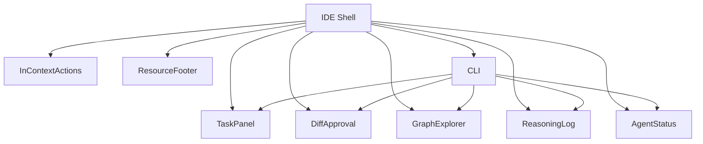

# Design Document: nexus-ide

## Overview

nexus-ide is a minimalist, AI-powered coding IDE and integrated CLI purpose-built for Nexus V2’s multi-agent workflow. Unlike traditional code editors, nexus-ide places agent proposals, task flows, and semantic code navigation at the heart of the experience. Every UI element, from diff approval widgets to semantic graph overlays, is streamlined to focus on actionable context—eliminating bloat and surfacing only what’s needed for each task. The CLI mirrors all major IDE actions, supporting terminal-centric workflows. The result is a game-changing, integrated coding environment where agents, user approvals, and code changes are unified into a single contextual flow.

## Architecture

The system is composed of composable widgets for each functional area:



## Components and Interfaces

### Intelligent Task & Change Panel
- Unified sidebar listing all active tasks
- Shows agent assignments, status, direct links to affected files/functions
- Filter by status, agent

```typescript
interface TaskPanelProps {
  tasks: Task[];
  agents: AgentInfo[];
  onSelectTask: (taskId: string) => void;
  filter: { status?: TaskStatus; agent?: string };
}
```

### Minimalist Code Diff/Approval Widget
- Inline diff view, two-column layout
- One-click Approve/Reject, Explain button, impact summary
- Changes grouped by logical task

```typescript
interface DiffApprovalProps {
  changes: CodeChange[];
  onApprove: (changeId: string) => void;
  onReject: (changeId: string) => void;
  onExplain: (changeId: string) => void;
}
```

### Semantic Code Graph Explorer
- Sidebar/minimap showing relationships relevant to current task
- Expandable nodes (Calls, Used By, Imports)
- Agent overlays for proposed changes

```typescript
interface GraphExplorerProps {
  graph: SemanticCodeGraphData;
  activeTask: Task;
  overlayProposals?: CodeChange[];
  onNodeSelect?: (nodeId: string) => void;
}
```

### Conversation & Reasoning Log
- Panel with history of agent decisions/proposals/reviews/user approvals
- Filter/search by agent or keyword
- Jump to affected code

```typescript
interface ReasoningLogProps {
  log: AgentMessage[];
  filter?: { agent?: string; keyword?: string };
  onJumpToCode?: (file: string, line?: number) => void;
}
```

### In-Context Actions
- Right-click/hover for context-aware actions:
  - Approve AI Change, Review Impact, Request Explanation

```typescript
interface InContextAction {
  label: string;
  action: (context: { file: string; function?: string }) => void;
  visible: (context: { file: string; function?: string }) => boolean;
}
```

### Agent Status Dashboard
- Unobtrusive widget showing agent progress/errors/readiness
- Click for agent activity trace

```typescript
interface AgentStatusProps {
  agents: AgentInfo[];
  progress: { [agentName: string]: TaskStatus };
  errors?: { [agentName: string]: string };
  onClick?: (agentName: string) => void;
}
```

### Resource & API Status Footer
- Minimal bar showing API usage (tokens, cost, quotas) and vector store health

```typescript
interface ResourceFooterProps {
  tokenUsage: TokenUsage;
  vectorStoreStatus: 'healthy' | 'degraded' | 'offline';
}
```

### CLI Integration
- All major flows callable via CLI (mirrored widgets)
- Sample commands:
  - `nexus approve`, `nexus diff`, `nexus status`, `nexus tasks`, `nexus code`, `nexus review`, `nexus graph`, `nexus context`

## Data Models

For all UI features, use and reference existing Nexus types:
- Task, SubTask, AgentInfo, CodeChange, SemanticCodeGraphData, AgentMessage, TokenUsage

## Error Handling

- UI displays errors non-intrusively; agent errors surfaced in dashboard
- Approval/reject actions re-prompt on failure
- CLI returns codes for integration/test flows

## Testing Strategy

### Unit Testing
- Widget behaviors: example-based tests (edge cases for filters, approvals, agent status)

### Property-Based Testing
- Core properties:
  - For any task, approval/rejection must update status and history correctly
  - For any set of code changes, diff widget groups and displays them according to logical task
  - For any semantic graph, explorer overlays agent proposals and maintains accurate relationships
  - For any resource usage update, footer displays accurate token/api state

**Property Test Library:** fast-check (TypeScript)

### Integration Testing
- End-to-end flows: agent proposals, user action, code updates, task completion

## Performance Considerations

- Widgets must render instantly (<100ms)
- Graph overlay operations scale with project size
- Resource footer updates live without blocking UI

## Security Considerations

- No user-sensitive data shown by default
- Approval/reject actions locked to authenticated users
- Secure access to vector store and agent logs

## Dependencies
- React / TypeScript for IDE shell
- Existing Nexus types and agent modules
- fast-check for property tests
- Qdrant, tree-sitter, OpenAI/Anthropic SDKs for agent context

## Algorithmic Pseudocode

### Main IDE Task Flow

```pascal
ALGORITHM handleTaskFlow(task)
INPUT: task of type Task
OUTPUT: updatedTask, agentActions

BEGIN
  // Step 1: Display task panel with active tasks
  displayTaskPanel(task)

  // Step 2: Attach relevant agent proposals as overlays in semantic graph
  for each agent in agents do
    overlayProposalInGraph(agent, task)
  end for

  // Step 3: Show diff/approval widget for affected files/functions
  for each change in task.changes do
    showDiffApproval(change)
  end for

  // Step 4: Capture approval/reject actions
  onApprove(change) => updateTaskStatus(task, 'approved', change)
  onReject(change) => updateTaskStatus(task, 'rejected', change)

  // Step 5: Log agent/user actions in reasoning log
  logAgentDecision(agent, task)
  logUserApproval(user, task)

  // Step 6: Update agent dashboard progress
  updateAgentStatusDashboard(agents, task)

  // Step 7: Update resource/api footer
  updateResourceFooter(tokenUsage, vectorStoreStatus)
END
```

## Example Usage

```typescript
// Approving a code change in the diff widget
const approveChange = (changeId: string) => {
  // Find change, update status, log action
  updateTaskStatus(task, 'approved', changeId);
  logUserApproval(user, task);
};

// CLI invocation for approving change
$ nexus approve --task <id> --change <id>
```

## Correctness Properties

*A property is a characteristic or behavior that should hold true across all valid executions of the system—formal statements about what the system must do. Properties bridge specifications and correctness guarantees.*

### Property 1: Approval/Reject updates task & log
For any task and proposed change, approving or rejecting must update the task status and log the user action in the reasoning log.
**Validates: Requirements X.Y**

### Property 2: Diff widget groups by logical task
For any set of code changes, the diff/approval widget must group and display changes by their logical task, not raw file.
**Validates: Requirements X.Y**

### Property 3: Semantic graph overlays agent proposals
For any task and agent proposal, the graph explorer overlays the proposal and relationships remain accurate.
**Validates: Requirements X.Y**

### Property 4: Resource footer reflects accurate API state
For any change to token usage or vector store state, resource footer displays accurate, current status without delay.
**Validates: Requirements X.Y**

